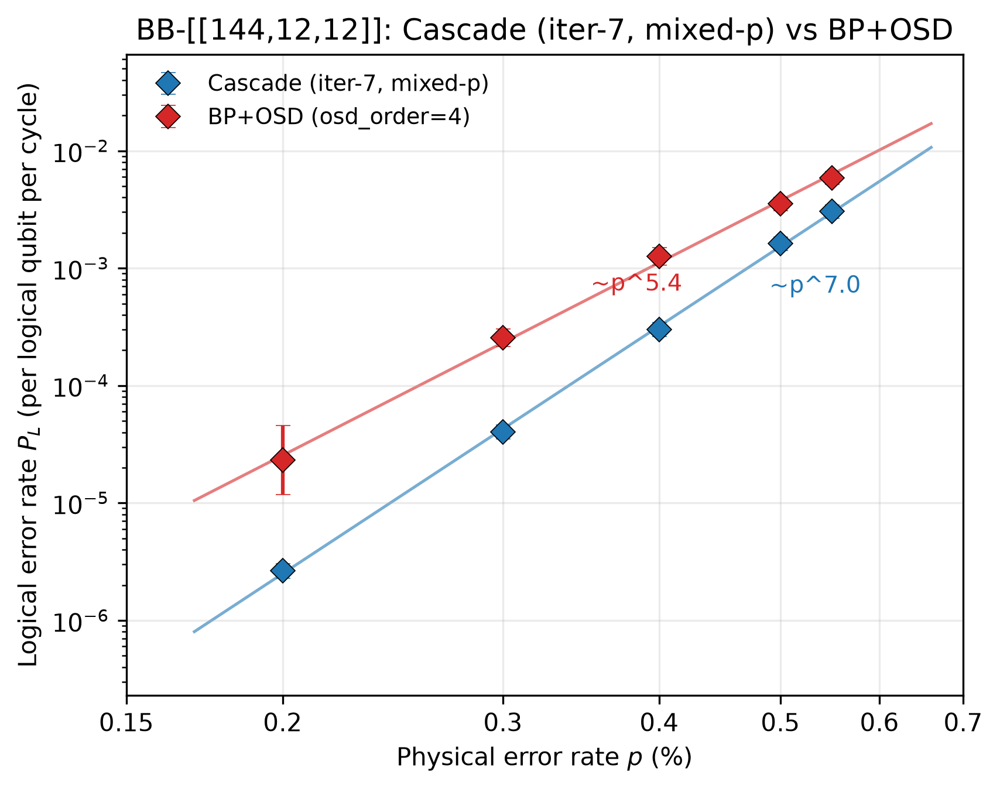

# QEC-Cascade

Reproduction and extension of the **Cascade neural decoder** for quantum error
correction (arXiv:2604.08358), in PyTorch + Stim. The decoder is trained and
evaluated on two code families:

- **Rotated surface code** (d = 5, 7, 9) under circuit-level depolarizing noise,
  benchmarked against MWPM (PyMatching).
- **Bivariate bicycle (BB) codes** — [[72,12,6]] and the [[144,12,12]] "gross
  code" — benchmarked against BP+OSD (stimbposd).

All training/evaluation runs on SLURM (single node, 1–8 GPUs); every result
JSON in `results/` comes from a logged SLURM job.



*Logical error rate per logical qubit per cycle on the [[144,12,12]] gross code
(12 syndrome rounds, circuit-level depolarizing noise), our data, in the style
of Fig. 1(b) of the Cascade paper. Blue: our iteration-7 mixed-p Cascade model;
red: BP+OSD (osd_order=4). Error bars are Wilson 95% CIs; lines are single
power-law fits with the measured exponents (~p^7.0 vs ~p^5.4). Over
p = 0.2%–0.55% a two-component (waterfall + floor) fit is not yet resolvable
from our data, so we plot the honest single-slope fits. Reproduce with
`scripts/34_scalable_fig1bc.py`.*

**Contents** — [Results](#headline-results-so-far) ·
[Method](#method) · [What it took](#what-it-took-to-make-bb-144-work) ·
[Layout](#repository-layout) · [Setup](#setup) · [Usage](#usage) ·
[Data index](#index-of-results-and-reports) · [Tests](#tests) ·
[Caveats](#reproducibility-caveats-and-known-gaps) · [Status](#status)

---

## Headline results so far

### BB-144 [[144,12,12]]: Cascade beats BP+OSD at all five swept points

Final evaluation of the iteration-7 model (`results/bb144_v7_mixp.json`, EMA
weights, best checkpoint at step 36k of 40k) against the BP+OSD baseline
(`results/bb144_mw_bposd_p*.json`), P_L = logical error rate per logical qubit
per cycle (k = 12, 12 rounds):

| p (phys) | Cascade P_L/cycle | BP+OSD P_L/cycle | ratio |
|----------|-------------------|------------------|-------|
| 0.002    | 2.63e-6           | 2.32e-5          | 8.8×  |
| 0.003    | 4.02e-5           | 2.56e-4          | 6.4×  |
| 0.004    | 3.00e-4           | 1.26e-3          | 4.2×  |
| 0.005    | 1.62e-3           | 3.53e-3          | 2.2×  |
| 0.0055   | 3.04e-3           | 5.88e-3          | 1.9×  |

Every Cascade point has ≥200 block failures. Caveat on the p = 0.002 row: the
BP+OSD baseline has only 8 block failures there, so the 8.8× ratio carries a
wide CI (roughly 4×–18×), but the win direction is stable. Fitted power-law
exponents over this range: Cascade ~p^7.00 (95% CI [6.88, 7.13]) vs BP+OSD
~p^5.45 (95% CI [5.23, 5.65]) — Cascade's curve is not just lower but steeper,
so the advantage grows as p decreases.

A zero-syndrome sanity probe of the final model (`scripts/33_probe_bb144_zero_v7.py`)
fires 0/12 readout heads on the all-zero syndrome, and at p = 0.0005 the
measured p_block is 0 — i.e. no spurious low-p error floor (see below for why
this probe exists).

### Surface code: error-suppression factor Λ (H=512, d5→d9 weighted fit)

Λ = factor by which the logical error rate per cycle drops when d → d+2.
Fits over d = 5, 7, 9 with ≥200 block failures per point
(`results/surface_lambda_v5*.json`, figure `figures/surface_waterfall_v5.pdf`).

| p (phys) | Λ Cascade [95% CI] | Λ MWPM [95% CI] |
|----------|--------------------|-----------------|
| 0.002    | 7.48 [6.73, 8.20]  | 5.25 [4.96, 5.57] |
| 0.0015   | 10.02 [9.01, 10.98] | 6.82 [6.42, 7.23] |
| 0.001    | 15.38 [13.83, 16.85] | 10.60 [10.01, 11.22] |

The Λ-vs-p "waterfall" confirms the deep sub-threshold scaling regime: Cascade's
suppression factor grows markedly faster than MWPM's as p decreases. The Λ
ratio at p = 0.002 is 1.42× with non-overlapping CIs.

Underlying per-distance rates at p = 0.002 (d rounds of syndrome extraction,
k = 1), from `results/surface_lambda_v5.json`:

| d | shots | Cascade P_L/cycle | MWPM P_L/cycle |
|---|-------|-------------------|----------------|
| 5 | 3.77e5  | 1.07e-4 | 2.11e-4 |
| 7 | 2.47e6  | 1.16e-5 | 4.04e-5 |
| 9 | 1.16e7  | 1.92e-6 | 7.65e-6 |

### BB-72 [[72,12,6]]

@ p=0.005 (6 rounds): Cascade P_L/cycle = 1.31e-3 vs BP+OSD 5.38e-3
(`results/bb72_v3_iter3_bposd.json`).

---

## Method

### Model

Both models follow the paper's shape — *embed → L residual bottleneck blocks →
final scatter conv → masked pool → one MLP head per logical observable* — and
differ only in the spatial operator and the pooling, because the two code
families have different geometry.

**Surface code** (`src/cascade/models/cascade.py`). Input is a
`(B, T, H, W, C=2)` tensor of binary detection events (C = X/Z stabiliser
type). A 1×1×1 `Conv3d` lifts it to `hidden` channels; L `BottleneckBlock`s
follow, each `BatchNorm3d → SiLU → 1×1 down-project to hidden/4 →
SurfaceConv(k=3) → 1×1 up-project`, with the residual branch scaled by
`1/sqrt(2L)`. A final `Conv3d(hidden, hidden × k_logicals, kernel=3)` splits
per-logical feature maps, which are **masked-average-pooled** over `(T, H, W)`
and fed to a per-observable 2-layer MLP (`hidden → 2·hidden → 1`). A persistent
grid mask zeroes every position where no detector exists, at the input and at
the pool, so absent detectors cannot bias activations.

**BB codes** (`src/cascade/models/cascade_bb.py`). BB codes live on an
ℓ×m torus rather than a planar grid, so:

- the hidden layout is `(B, F, T, ℓ, 2m)` with the trailing axis packing
  `[Z-checks | X-checks]` — chosen so stock `Conv3d`/`BatchNorm3d` still apply;
- the spatial operator is `BBTorusConv` (`models/conv_bb.py`), a generalised
  convolution over the BB torus using the code's `a`/`b` shift polynomials,
  wrapped by an adapter that reshapes to `(B, F, T, ℓ, m, C=2)` and back;
- separate `embed_z` / `embed_x` embeddings are used per check type;
- **pooling is Tanner-graph-aware instead of uniform**: check-node features are
  scattered to per-data-qubit features through a fixed (non-learned) normalised
  `[H_z; H_x]` matrix, averaged over time, then pooled *only over the support of
  each logical operator* `lz[i]` before that logical's head. A per-logical
  detector-relevance mask marks which checks can carry information about which
  logical.

This support-restricted pooling is what makes the readout heads trainable at
all — see the dead-head root cause below.

### Training

`src/cascade/train/trainer_v2.py`, driven by `scripts/12_train_surface_v2.py`
(surface) and `scripts/14_train_bb_v3.py` (BB).

- **Data** is generated on the fly by Stim (`data/stim_dataset.py`): circuit-level
  depolarizing noise memory experiments, sampled directly into tensors — no
  fixed dataset on disk.
- **Loss** is `binary_cross_entropy_with_logits` over all k observables, in fp32.
- **Optimizer** is **Muon** for matrix-valued parameters + **Lion** for the
  scalars (`train/optimizers.py`), matching the paper; the Newton–Schulz step
  stays in fp32 while the rest runs bf16 mixed precision. `optimizer="adamw"`
  is available as a fallback.
- **Effective batch ≈ 3300** (the paper's batch) via gradient accumulation —
  e.g. BB-144 uses micro-batch 48 × accum 69.
- **EMA** of the weights (`models/ema.py`) is tracked throughout and is what
  gets evaluated; EMA metrics are ignored before `5/(1-decay)` steps because
  the average is still dominated by the random init.
- **Noise curriculum** (`train/curriculum.py`): 2 % of steps at a low `p1`,
  2 % linear anneal `p1 → p2`, the rest at `p2`.
- **Mixed-p training** (iteration 7, BB-144): instead of a single `p2`, each
  micro-batch draws p **log-uniformly** from [0.001, 0.0055], snapped to a
  16-point cached circuit grid so Stim compilation is amortised. Model
  selection is on the mean p_block at the two endpoint noise levels.
- **Per-head reweighting**: heads sitting at chance level get up to 4× the mean
  loss weight (`--head-reweight-alpha/-clamp/-ema`), which keeps the 12 BB
  logical heads learning at similar rates.
- **Checkpointing** is atomic `last.pt` + auto-resume keyed on the run tag, so a
  long run can be chained across SLURM time limits (BB-144 iter-7 was three
  48-hour segments, ~106 GPU-h total at ~0.105 steps/s).

Reference configurations actually used for the headline numbers:

| run | code | hidden | blocks | rounds | steps | eff. batch | train noise |
|-----|------|--------|--------|--------|-------|-----------|-------------|
| `v5_d5` / `d7` / `d9` | surface d=5/7/9 | 512 | 6 / 8 / 10 | d | 40 000 | ≈3330 | p=0.005 (warmup 0.001) |
| `v7_bb144_mixp` | BB-144 | 256 | 12 | 12 | 40 000 | 3312 | log-uniform [0.001, 0.0055] |

### Evaluation

`scripts/20_eval_decoder.py` (`eval/decoder_compare.py`) runs the neural decoder
and the classical baseline **on the same sampled shots**, at each p in a sweep.

- Sampling continues until `--target-failures` (200 for the headline runs) block
  failures are collected, capped by `--shots`; a point with fewer than
  `--min-errors` (100) failures is flagged `sufficient: false` and is not used
  for fits.
- Block error rate → per-cycle-per-logical rate uses the paper's Eq. (1)
  inversion (`eval/pblock_to_pl.py`):
  `P_L = (1 − (2(1−P_block)^{1/k} − 1)^{1/R}) / 2`.
- Error bars are **Wilson 95 % intervals** on `P_block`, mapped through that
  (monotone) transform — so the CIs are asymmetric and correct at small counts.
- Λ fits (`eval/lambda_fit.py`) are weighted log-linear fits over d with
  bootstrapped CIs; waterfall fits live in `eval/waterfall.py`.

**Baselines.** MWPM via PyMatching (`decoders/mwpm.py`). BP+OSD via stimbposd
with `osd_order=4` (`decoders/bposd.py`). BP+OSD on BB-144 costs ~22 s/shot
single-core, so its baseline points are separate per-p SLURM jobs, with top-up
jobs merged by `scripts/merge_bposd_points.py` — this is why the p = 0.002
baseline has only 8 failures.

---

## What it took to make BB-144 work

Two failure → root-cause → fix cycles, both documented in `reports/`:

1. **Dead readout heads (iteration 6 prep).** With logical representatives
   picked by plain Gaussian elimination, the high-weight logicals (weight
   24–38) produce permanently dead readout heads — a mean-pool readout cannot
   represent a wide XOR parity. Fixed by a **minimum-weight logical basis**
   (randomized information-set search; all 12 logicals at weight d = 12),
   after which all 12 heads train. See
   `reports/iteration_6_deadhead_rootcause.md`.

2. **Single-p training does not generalize (iteration 6 → 7).** The
   iteration-6 model, trained only at p = 0.0055, evaluated fine near its
   training point but hit a p_block floor of ~0.40 at low p — losing to BP+OSD
   by ~157× at p = 0.002. Probes showed the model misreads sparse low-p
   syndromes (even at p = 0.0005 it declared failures ~42% of the time).
   Iteration 7 retrained from scratch with **mixed-p training**: p drawn
   log-uniformly from [0.001, 0.0055] per micro-batch (16-point cached circuit
   grid), model selection on the average of p_block at the two endpoint noise
   levels. That single change removed the floor entirely and produced the
   five-point sweep above. Full narrative: `reports/iteration_6_status.md`,
   `reports/iteration_7_plan.md`, `reports/iteration_7_status.md`.

---

## Repository layout

```
src/cascade/
  codes/        surface.py, bb.py (BB construction, min-weight logical basis,
                distance utilities), bb_circuit.py (Stim memory circuits),
                base.py (Code / DetectorLayout interfaces)
  models/       cascade.py (surface), cascade_bb.py (BB), blocks.py,
                conv_surface.py, conv_bb.py (BBTorusConv), ema.py
  decoders/     mwpm.py (PyMatching), bposd.py (stimbposd) baselines
  data/         stim_dataset.py (on-the-fly sampling), tensorize.py
  train/        trainer.py, trainer_v2.py (Muon+Lion+EMA+curriculum),
                optimizers.py, curriculum.py, lr_schedule.py
  eval/         decoder_compare.py, pblock_to_pl.py, lambda_fit.py,
                waterfall.py, post_select.py
scripts/        numbered pipeline entry points, 02→34 (train / eval / probes /
                fits / figures)
slurm/          one batch script per train/eval/smoke/probe job
tests/          pytest suite (23 tests over codes, model, BB, eval)
reports/        per-iteration lab notes (status, root-cause analyses,
                handoffs, literature surveys) + result tables (md/csv)
results/        evaluation outputs (JSON) — small, committed
figures/        generated figures (PDF/PNG)
```

Script numbering is roughly chronological and grouped: `1x` = training,
`2x` = evaluation and analysis, `3x` = probes and figures.

---

## Setup

```bash
python -m venv .venv && source .venv/bin/activate
pip install -e .          # or: pip install -e ".[dev]" for pytest
```

Requires Python ≥ 3.10 and a CUDA GPU for training (H100/H200-class used here;
evaluation of small models runs on CPU too, slowly). Key dependencies: `torch>=2.5`,
`stim`, `sinter`, `pymatching`, `stimbposd`, `lion-pytorch`, and Muon
(`muon-optimizer` from KellerJordan/Muon, or `torch.optim.Muon` on torch ≥ 2.12).

### External code

`external/BivariateBicycleCodes/` (BB-code distance utilities used for
cross-checks) is a third-party clone and is not committed. To restore:

```bash
git clone https://github.com/sbravyi/BivariateBicycleCodes external/BivariateBicycleCodes
```

Model checkpoints and raw SLURM logs are intentionally not committed
(~1 GB / run); they live on the cluster.

---

## Usage

### Reproducing the figures (no GPU, no checkpoints)

Figure scripts are pure numpy/matplotlib over the committed `results/` JSONs:

```bash
.venv/bin/python scripts/34_scalable_fig1bc.py      # headline figure above
.venv/bin/python scripts/32_bb144_iter7_figures.py  # iter-7 threshold/headline plots + tables
.venv/bin/python scripts/28_waterfall_fit.py        # surface Λ waterfall
.venv/bin/python scripts/23_fit_lambda.py           # Λ fits from surface_d*.json
```

### Smoke test first

Every training config has a matching smoke job that runs a handful of steps on
the `dev` partition. Always run it before committing a multi-day chain:

```bash
sbatch slurm/smoke_bb_v7_mixp.sh          # BB-144 mixed-p, dev partition
python scripts/10_smoke_test.py           # end-to-end sample→forward→backward, seconds
```

### Training

Training is **SLURM-only** — never on a login node. Each launcher takes the code
size / distance as `$1`:

```bash
sbatch slurm/train_surface_v5.sh 9          # surface d=9, H=512, L=10, 40k steps
sbatch slurm/train_bb_v7_mixp.sh 144        # BB-144 mixed-p, 40k steps
```

Long runs are chained across the 48-hour wall limit; the trainer auto-resumes
from the tag directory, so the chain is just a dependency list:

```bash
J=$(sbatch --parsable slurm/train_bb_v7_mixp.sh 144)
J2=$(sbatch --parsable --dependency=afterany:$J slurm/train_bb_v7_mixp.sh 144)
sbatch --dependency=afterany:$J2 slurm/train_bb_v7_mixp.sh 144
```

The run tag (`--tag`) selects the checkpoint directory and is the resume key —
**a new experiment must get a new tag**, or it will silently resume the old run.

### Evaluation

```bash
sbatch slurm/eval_bb144_v7_mixp.sh      # Cascade sweep, 5 noise points
sbatch slurm/eval_bb144_mw_bposd.sh     # BP+OSD baseline (one job per p)
sbatch slurm/eval_surface_v5.sh 9       # surface d=9 vs MWPM
```

Or directly, e.g. the exact command behind the headline BB-144 numbers:

```bash
python scripts/20_eval_decoder.py \
    --code bb --bb-variant 144 \
    --ckpt checkpoints/bb_144_12_12_v7_bb144_mixp/best.pt \
    --prefer auto --p 0.002 0.003 0.004 0.005 0.0055 \
    --shots 10000000 --target-failures 200 --min-errors 100 \
    --batch 128 --no-mwpm \
    --out results/bb144_v7_mixp.json
```

`--prefer auto` picks EMA weights when present. Cluster specifics: account
`GOV114009`, partition `8gpus` (`dev` for smokes), 1 GPU + 8 CPUs per task.

---

## Index of results and reports

### `results/`

| file | what it is |
|------|------------|
| `bb144_v7_mixp.json` | **headline** — iter-7 Cascade BB-144, 5-point sweep |
| `bb144_mw_bposd_p*.json` | BP+OSD BB-144 baseline, one file per p (+ `_topup_*`, `_merged`) |
| `bb144_mw_v4.json` | iter-6 single-p model — the run that showed the low-p floor |
| `bb72_v3_iter3_bposd.json` | BB-72 iter-3 Cascade vs BP+OSD @ p=0.005 |
| `surface_d{5,7,9}_v5.json` | surface Cascade vs MWPM sweeps, H=512 (v2/v4 = earlier iterations) |
| `surface_lambda_v5*.json` | Λ fits at p = 0.002 / 0.0015 / 0.001 |
| `surface_waterfall_v5.json` | Λ-vs-p waterfall data |
| `deliverable/`, `archive/` | figures-cited JSONs and side experiments (latency, post-selection, reliability); see `results/README.md` |

### `reports/`

Per-iteration lab notes, newest last: `iteration_2` … `iteration_7_status.md`,
plus `iteration_6_deadhead_rootcause.md` (why the readout heads died),
`iteration_7_plan.md` (the mixed-p design, written before the run),
`bb144_iter{6,7}_table.{md,csv}` (result tables), `paper_review.md` and
`paper_intro_and_progress.md` (write-up drafts), and handoff docs.

`reports/universal_decoder_survey.md` is a verified literature map on universal
(code-agnostic) neural decoders and FPGA decoding, with every citation checked
against the source (`reports/universal_decoder_survey_evidence.json`).

---

## Tests

```bash
pip install -e ".[dev]"
pytest                      # 23 tests; slow ones are marked
pytest -m "not slow"        # skip the multi-second ones
```

Coverage is on the parts where a silent bug would poison every downstream
number: code construction and stabiliser commutation (`test_codes.py`,
`test_bb.py` — including the min-weight logical basis), model shape/mask
handling (`test_model.py`), and the P_block → P_L conversion and fits
(`test_eval.py`).

---

## Reproducibility, caveats and known gaps

**Statistical caveats.**
- The p = 0.002 BP+OSD baseline point has only 8 block failures (≈22 s/shot made
  more prohibitive); its ratio CI spans roughly 4×–18×.
- Power-law exponents are single-slope fits over 0.2 %–0.55 %. A two-component
  (waterfall + floor) fit is not resolvable from this data, and the exponents
  should not be extrapolated far below p = 0.002.
- Λ fits use only d = 5, 7, 9. An earlier d = 11 retrain (in `results/archive/`)
  underperformed MWPM and is not part of any headline claim.

**Environment coupling.** SLURM scripts hard-code the cluster's account
(`GOV114009`), partition, and an absolute `WORKDIR` — running anywhere else means
editing those three things. The account migration of 2026-07-08 left the
surface-track and older BB scripts pointing at the pre-migration path; they were
all repointed in commit `d78e0cf`, so every script in `slurm/` and `scripts/` now
resolves under the current account. Training scripts take their checkpoint
directory from `Path(__file__).parents[1] / "checkpoints"`, i.e. relative to the
repo, so a future move only touches `WORKDIR` in `slurm/`.

Historical documents deliberately keep the old paths: `HANDOFF_TO_NEW_ACCOUNT.md`
and the `reports/iteration_*.md` lab notes record where each run actually
executed at the time, and are not rewritten.

**Not committed** (by `.gitignore`): `.venv/`, `checkpoints/` (~1.2 GB),
`logs/`, `external/`. Results, figures and reports are committed, so every
number and figure in this README can be re-derived from the repo alone.

**Determinism.** Training samples noise on the fly from Stim and is not seeded
for bit-exact reproducibility; re-running a config reproduces the statistics,
not the exact weights.

**No license file yet** — the repo is private and defaults to all-rights-reserved.
Add one before making it public.

---

## Status

Research in progress (2026-07). Surface-code results (iter-5) and the BB-144
mixed-p result (iter-7, five-point win over BP+OSD) are final.

`scripts/34_scalable_fig1bc.py` also contains a stub for the companion
accuracy-vs-latency panel (Fig. 1(c) of the paper); it is not implemented yet
because no BB-144 inference-latency measurements exist for either decoder.

Candidate next steps:

1. **BB-144 latency measurements** for the accuracy–latency panel — the one
   concrete gap in the Fig. 1 reproduction (`scripts/25_inference_latency.py`
   already exists for the neural side).
2. **A next iteration or a different code family** — the mixed-p recipe and the
   support-restricted BB pooling are the two transferable ingredients.
3. **Paper writing** — `reports/paper_intro_and_progress.md` is the current draft.

---

## References

- Cascade neural decoder — arXiv:2604.08358 (the paper being reproduced).
- Bravyi et al., bivariate bicycle codes / the [[144,12,12]] gross code;
  distance utilities from
  [sbravyi/BivariateBicycleCodes](https://github.com/sbravyi/BivariateBicycleCodes).
- Stim (Gidney), PyMatching (Higgott), stimbposd / BP+OSD (Roffe et al.) for
  circuit simulation and the classical baselines.
- Muon (KellerJordan) and Lion for the optimizer pair.
